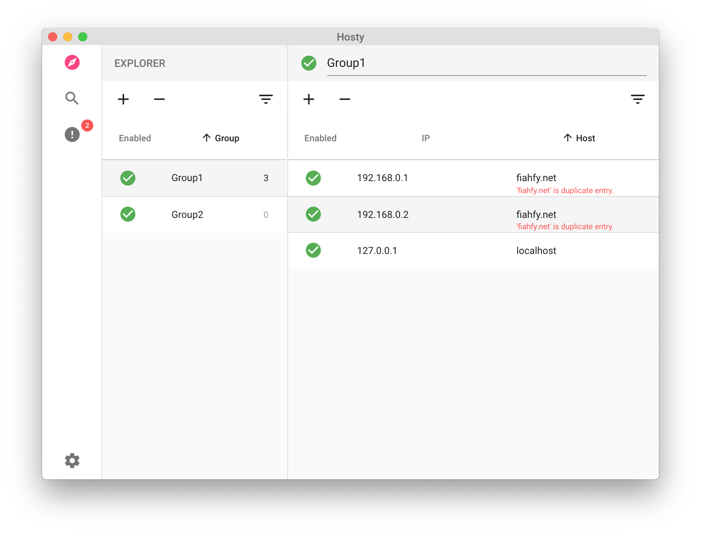
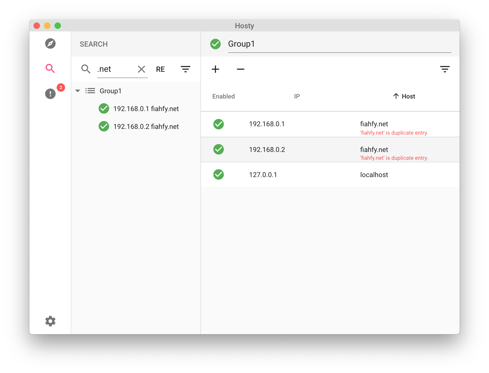
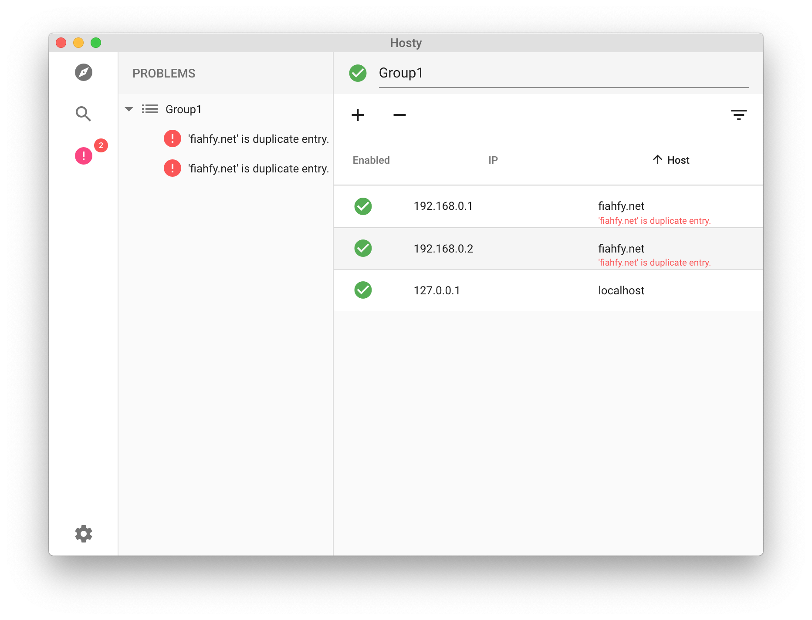

# Hosty
[](https://travis-ci.com/fiahfy/hosty)

> Hosts File Manager based on Electron.


## Features
* Manage hosts with groups
* Cross platform support
* Change theme (Light/Dark)


## Screenshots





## Installation
1. Download the file for your platform from [releases page](https://github.com/fiahfy/hosty/releases).
2. Open `.dmg` for OS X or run `.exe` for Windows.


## Development
``` bash
# install dependencies
yarn

# serve with hot reload
yarn dev
```
